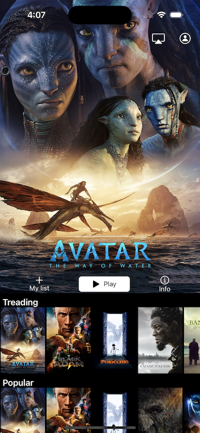
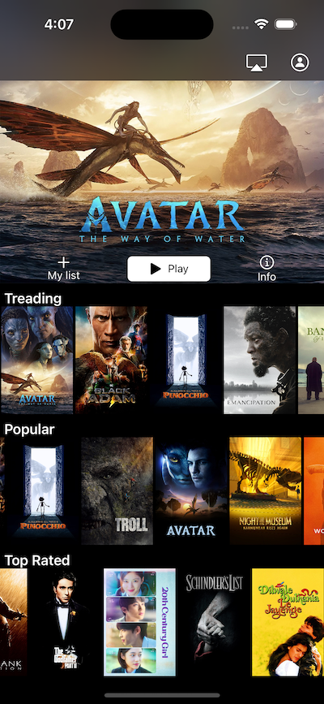
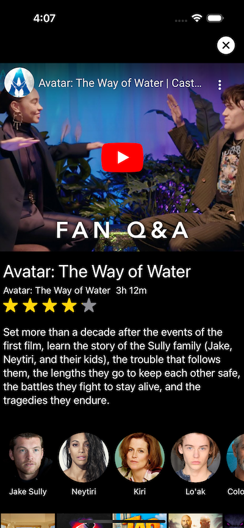

# movieApp

Simple App for practicing SwiftUI using MVVM architecture and using TMDB API

## How to run

1) Open the `MoviesApp.xcodeproj` file and wait for XCode to resolve all dependencies.
2) Add the API key for TMDB in the file `Movies.xcconfig` in the folder Supporting Files
3) Press run on your desired device. 

